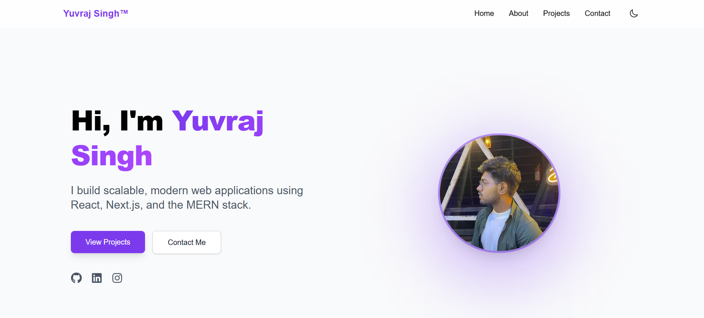

# ProftFolio

Welcome to **ProftFolio** – a modern, customizable portfolio built using Next.js! Showcase your skills, projects, and experience with a sleek, responsive design.



---

## 🚀 Features

- **Built with Next.js** for optimal performance & SEO
- **Responsive Design** – looks great on any device
- **Easy Customization** – update your info in config files
- **Project Showcase** – add, edit, and feature your best work
- **Contact Section** – get in touch with potential employers or collaborators
- **Dark/Light Mode** (if implemented)
- **Animated UI** with modern CSS

---

## 🖼️ Preview


<table>
  <tr>
    <td></td>
    <td></td>
    <td></td>
  </tr>
</table>

---

## 🛠️ Getting Started

1. **Clone the repository**
    ```bash
    git clone https://github.com/yuvrajsingh08/ProftFolio-Nextjs.git
    cd ProftFolio-Nextjs
    ```

2. **Install dependencies**
    ```bash
    npm install
    ```

3. **Run the development server**
    ```bash
    npm run dev
    ```
    Visit [http://localhost:3000](http://localhost:3000) to view your portfolio.

---

## 📧 Contact

Feel free to reach out via [LinkedIn](https://www.linkedin.com/in/yuvrajsingh08) or [email](mailto:youremail@example.com).

---

## ⭐️ Show your support

If you like this project, please star the repo!

---

**Happy Building! 🚀**
